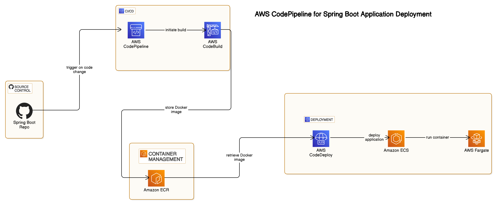

# aws-codepipeline-ecs-deployment
CI/CD pipeline to deploy Spring Boot app on AWS ECS Fargate.

This is a sample microservice to deploy it on AWS ECS.

To build automated AWS CodePipeline and deploy microservice to AWS ECS, follow tutorial as shown in video :

Video Link :https://youtu.be/ARGmrYFfv44

Health Check command for AWS Task definition :
```
CMD-SHELL,curl -f http://localhost:8080/actuator/health || exit 1
```
# AWS CodePipeline Setup for Spring Boot App

This document provides a step-by-step guide to setting up a **CI/CD pipeline** using **AWS CodePipeline** for a **Spring Boot application**.

---


## **📌 Workflow Overview**
This setup automates the deployment process, ensuring seamless code integration, build, and deployment. Below is the **workflow breakdown**:

1. **Source Code Management** → GitHub
2. **Build & Package** → AWS CodeBuild
3. **Container Image Storage** → Amazon ECR
4. **Deployment** → AWS CodeDeploy
5. **Execution** → Amazon ECS (Fargate)

---

## **🔄 Step-by-Step Workflow**

### **1️⃣ Source Phase (Version Control & Code Storage)**
📌 **Tool Used:** [GitHub](https://github.com/)  
📌 **Task:**
- The Spring Boot application is stored in a **GitHub repository**.
- It contains:
    - **Dockerfile** (to containerize the app).
    - **buildspec.yml** (to define build instructions for AWS CodeBuild).
- When changes are pushed to GitHub, it **triggers the AWS CodePipeline**.

---

### **2️⃣ Build Phase (Building & Packaging)**
📌 **Tool Used:** [AWS CodeBuild](https://aws.amazon.com/codebuild/)  
📌 **Task:**
- **CodeBuild** fetches the source code from GitHub.
- Reads **buildspec.yml** to:
    1. **Compile** the Spring Boot app.
    2. **Build** a Docker image.
    3. **Push** the built Docker image to **Amazon ECR** (Elastic Container Registry).

---

### **3️⃣ Storage Phase (Docker Image Storage)**
📌 **Tool Used:** [Amazon ECR](https://aws.amazon.com/ecr/)  
📌 **Task:**
- **ECR** is a container registry that stores Docker images.
- CodeBuild **pushes** the newly built Docker image to ECR.
- Later, **AWS ECS (Fargate) pulls this image for deployment**.

---

### **4️⃣ Deployment Phase (Deploying the Application)**
📌 **Tool Used:** [AWS CodeDeploy](https://aws.amazon.com/codedeploy/)  
📌 **Task:**
- **CodeDeploy** retrieves the latest Docker image from **Amazon ECR**.
- It **deploys** the image to **Amazon ECS (Elastic Container Service)** using **AWS Fargate**.

---

### **5️⃣ Execution Phase (Running the Application)**
📌 **Tool Used:** [Amazon ECS (with AWS Fargate)](https://aws.amazon.com/ecs/)  
📌 **Task:**
- **ECS (Fargate)** pulls the Docker image from **ECR** and runs it as a container.
- The updated Spring Boot app is **live and accessible** without managing infrastructure.

---

## **📌 Full CI/CD Flow Recap**

1️⃣ **GitHub** → Developers push code.  
2️⃣ **AWS CodeBuild** → Builds app, creates Docker image, and pushes it to **ECR**.  
3️⃣ **Amazon ECR** → Stores the Docker image.  
4️⃣ **AWS CodeDeploy** → Deploys the image from **ECR** to **ECS (Fargate)**.  
5️⃣ **Amazon ECS (Fargate)** → Runs the app as a container.

✅ **Fully automated deployment using AWS CodePipeline! 🚀**


Prerequisite :
1. AWS acconunt.
2. Git and docker installed on the machine.
3. Docker should be started before building docker image.
4. And your favourite code editor 